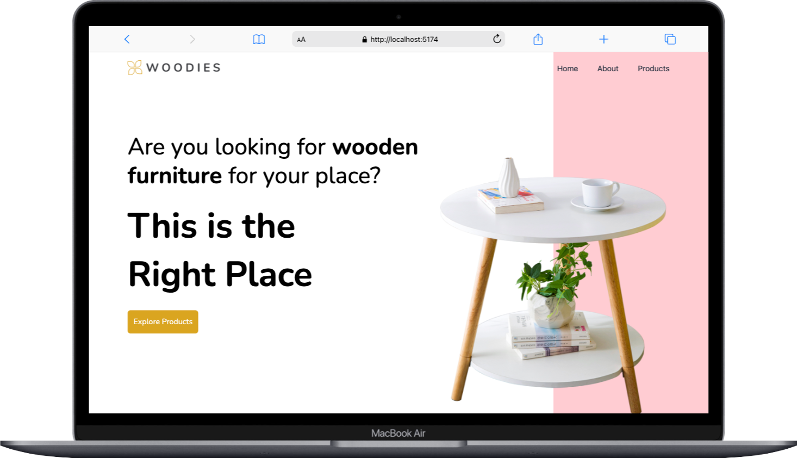

# WoodiesShop 🪵🛋️

WoodiesShop is a modern **React + TailwindCSS** web application showcasing wooden furniture products. Users can browse products, view details, and navigate seamlessly.



## 🚀 Features

- **Home Page** – Introductory section with a call to action.
- **Products Page** – Displays available furniture with images & descriptions.
- **Product Detail Page** – Shows in-depth details for each product.
- **Navigation & Footer** – Responsive design with smooth transitions.

## 🛠️ Tech Stack


## 📦 Installation

1. Clone the repository:

   ```sh
   git clone https://github.com/jutuli/Woodies-Shop.git
   ```

2. Navigate into the project:

   ```sh
   cd woodies-shop
   ```

3. Install dependencies & start the development server:

   ```sh
   npm install
   npm run dev
   ```
